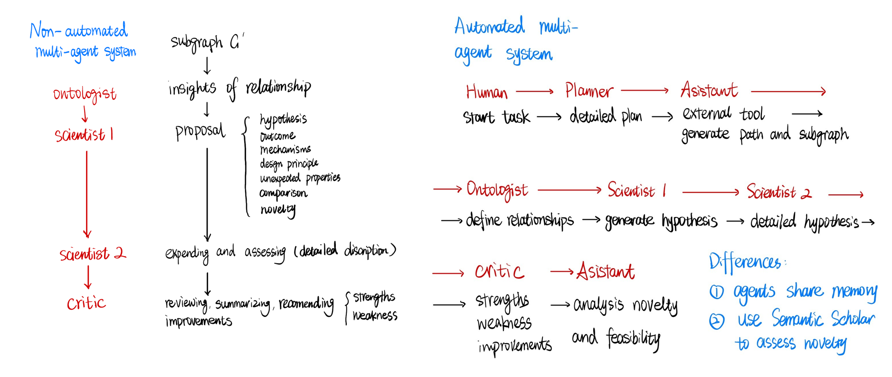

# Descovery of SciAgents System 

## Based on Original Research

This project is based on the work by:

> **A. Ghafarollahi, M.J. Buehler (MIT)**  
> *Massachusetts Institute of Technology*

**Paper**: [SciAgents: Automating scientific discovery through multi-agent intelligent graph reasoning](https://arxiv.org/abs/2409.05556)

**Original Codebase**: [lamm-mit/SciAgentsDiscovery](https://github.com/lamm-mit/SciAgentsDiscovery)

---

# Literature Review

## System Overview

SciAgents is built to automate the scientific-hypothesis generation process by integrating three core components:

- a large **ontological knowledge graph** that organizes scientific concepts and relationships across disciplines,
- **large language models (LLMs)** for interpreting, generating, and reasoning in natural language, and
- a **multi-agent architecture** where specialized LLM agents collaborate and critique hypotheses in situ.
   Together, these components enable autonomous generation and refinement of research hypotheses with emerging insights in materials science and beyond.

## Pathfinding Algorithm

This module is responsible for identifying one or more meaningful routes between two scientific concepts in the knowledge graph. It uses vector-based representations of graph nodes to estimate how close they are in conceptual space and combines this with a controlled amount of random variation. The algorithm introduces random “waypoints” along the route to produce alternative paths, then constructs a smaller subgraph around the selected route for further analysis. The purpose is to capture diverse and non‑obvious connections between concepts, serving as a foundation for hypothesis generation.

## Cooperation of Agents

This module organizes several specialized AI “agents,” each with a distinct role—such as planning the workflow, defining terms, generating research hypotheses, improving quantitative details, and critically reviewing the result. In one mode, agents follow a fixed sequence of steps. In another, a central manager dynamically determines which agent speaks or acts next based on the evolving context. All agents share conversational history and can access data retrieval tools and novelty‑checking functions when appropriate. The system thereby jointly produces a structured, refined, and reviewed research hypothesis. 

# Current Work

## Exploration of pathfinding function

**Objective**: To explore the key parameters influencing path search effectiveness, aiming to enhance an agent's ability to navigate to innovative scientific paths within a knowledge graph.

### **Path Cost Function Definition:**

$$
cost(v)=h(v,target)+α×random()
$$

Where:

- h(v,target) is the heuristic function, estimating the sematic similarities from the current node v to the target node.
- The second term, α×random(), introduces a randomness factor. This is used to increase diversity during the search process, preventing the agent from always selecting the lowest-cost path and encouraging the exploration of new potential paths.

---

### Manual parameter adjustment

**Randomness Factor α:** Controls the degree of influence of randomness.

- **Value Range:** 
$$
α∈[0, 0.2, 0.4, 0.6, 0.8]
$$

- When α=0, the search is completely deterministic. When α>0, path selection is affected by random perturbations, potentially leading to the exploration of paths in different areas.

**Number of Waypoints k:** Controls the number of "intermediate key points" (waypoints) introduced along the path from the starting point to the target.

- **Value Range:** 
$$
k∈[0, 2, 4, 6, 8]
$$

- More waypoints can make the path more flexible and potentially lead to more innovative directions.

---

### Automated parameter validation using multi-armed Bandit / RL 

**Objective**: To enhance the performance of the pathfinding function in SciAgents, we aim to automatically select optimal parameter combinations (α, k) that balance novelty and feasibility in search paths.

#### **Parameter Space**:

$$
\alpha \in \{0, 0.1, ..., 1\}
$$

$$
k \in \{0, 1, ..., 10\}
$$

These combinations form the **action/arm space**:

$$
A = \{ (\alpha_i, k_j) \}
$$

Each arm represents a unique parameter configuration.

#### **Reward Function Design**: 

The effectiveness of each path is measured by two scores:

 Novelty score and Feasibility score

$$
nov_t \in [0,1]
$$

$$
feas_t \in [0,1]
$$

The total reward at time \( t \) is defined as:

$$
R_t = \lambda \cdot nov_t + (1 - \lambda) \cdot feas_t, \quad \lambda \in [0,1]
$$

- λ allows weighting toward novelty (higher λ) or feasibility (lower λ) depending on the application goal.

#### **Optimization Goal**

The goal is to **maximize cumulative expected reward** over \( T \) rounds by choosing a sequence of actions:

$$
R_T = \max_{A_1,...,A_T} \mathbb{E} \left[ \sum_{t=1}^{T} R_t \right]
$$

#### **Regret Minimization**

We evaluate performance using **regret**, a common metric in multi-armed bandit theory:

$$
R(T) = \sum_{t=1}^{T} (\mu^* - \mu_{A_t})
$$

- \( \mu^* \): Maximum expected reward across all arms.
- \( \mu_{A_t} \): Expected reward of the selected action at time \( t \).

Lower regret implies better learning and decision-making performance.

---

#### **β — Bernoulli Thompson Sampling**

We model each trial's reward as a **Bernoulli outcome**:

$$
(Y_t \mid A_t = a) = \mathbf{1}\{ R_t \geq \tau \} \sim \text{Bern}(p_a), \quad \tau \in [0,1]
$$

- \( Y_t \in \{0,1\} \): Indicator whether the reward meets a quality threshold \( \tau \).

- \( p_a \): Success probability of parameter configuration \( a \).

- Prior distribution over \( p_a \):

  
$$
p_a \sim \text{Beta}(\alpha_{a,0}, \beta_{a,0})
$$

  

  **Algorithm: For t = 1 to T**

  1. **Sampling**  
     For each arm \( a \), sample from the posterior Beta distribution:

     
$$
\theta_{a,t} \sim \text{Beta}(\alpha_{a,t-1}, \beta_{a,t-1})
$$

  2. **Action Selection**  
     Choose the arm with the highest sampled value:

$$
A_t = \arg\max_a \theta_{a,t}
$$

 	  Then observe the binary outcome \( Y_t \).

  3. **Posterior Update**  
     Update the Beta parameters for the selected arm:

     
$$
\alpha_{A_t,t} = \alpha_{A_t,t-1} + Y_t
$$

$$
\beta_{A_t,t} = \beta_{A_t,t-1} + (1 - Y_t)
$$

​     

# Results

The **left chart** illustrates the impact of the **randomness factor α** on scoring. When α=0.0, path searching relies entirely on the heuristic function, resulting in the lowest novelty score of only 4, but a high feasibility score of 8, indicating strong stability. As α increases to 0.2, novelty quickly jumps to 7, while feasibility remains unchanged. This suggests that introducing a moderate amount of randomness helps discover more novel paths without sacrificing feasibility. Further increasing α to 0.4 and 0.6 shows a slight dip in novelty, though it stays high, while feasibility remains within a good range. Not until α=0.8 do both novelty and feasibility experience a slight decrease simultaneously.

The **right chart** displays how the **number of waypoints (k)** influences scoring. As k increases to 2, path novelty scores consistently rise, peaking at 8. Feasibility maintains its highest level (8) when k = 4. Continuing to increase k to 6 and 8, novelty remains high, but feasibility fluctuates and slightly decreases. This indicates that an excessive number of waypoints might introduce redundancy or even instability. Therefore, the optimal number of waypoints is recommended to be 2 or 4.

---

This dynamic curve chart illustrates the evolution of various metrics and parameter values over 20 experimental rounds. It shows how a multi-armed bandit algorithm (Bernoulli Thompson Sampling) optimizes parameters for path search functions. The image is divided into two sections, depicting scoring performance and parameter changes, respectively.

The **top chart** displays the **Novelty** (blue line) and **Feasibility** (orange line) scores obtained in each round of the path search. We can observe that the novelty score fluctuated significantly in the initial rounds, for instance, dropping to its lowest point (3 points) in round 4, then reaching its highest score (9 points) in round 20. This indicates that after multiple rounds of exploration, the system gradually discovered parameter configurations that generate more innovative paths. In contrast, the feasibility score generally remained high, stabilizing between 7 and 8 points for most rounds. This consistently high feasibility highlights that the practicality of the path selections was always ensured. 

The **bottom chart** shows the trajectories of two parameters over the rounds: the **randomness factor α** (blue line) and the **number of waypoints k** (red dashed line). The early stage exhibits a wide range of exploratory attempts, such as α shifting from 1.0 to 0.1, and various combinations of k from 0 to 8 being tried. This signifies that the system was in an exploration phase, aiming to quickly cover the entire parameter space. In the mid-stage, α frequently converged within the 0.6-0.8 range, while k was often set to 6 or 8. This suggests that the system began to narrow down to some high-performing parameter combinations. By the later stage, the fluctuations in both α and k visibly tightened, indicating that the system had entered an exploitation phase. This implies that, based on its prior exploration, it had largely determined the optimal solution's vicinity.

# Issues & Future Work

## Weak Cross-Domain Understanding

- The current knowledge graph is primarily built from approximately 1,000 biological-materials papers.
  - This causes the system to misinterpret terms from non-biomedical fields.
  - For example: The word "agents" is interpreted as a *"substance that initiates or facilitates a chemical or physical process"*, 
    rather than an *autonomous AI entity* in computer science or robotics.

- **Future Work:** 
  
  - Train ontological knowledge graphs using papers from diverse scientific disciplines, such as: Oncology, Medical imaging, Energy systems, Robotics  
  - Broaden system applicability beyond biological-materials domains to support cross-domain scientific reasoning.
  
  ---

## **Subjective Scoring without Mathematical Basis**

- Current novelty and feasibility scores (1–10) are **subjectively assigned** by the assistant.
- Scores are generated through LLM-based reasoning based on retrieved literature, without a defined algorithmic foundation.
- **Future Work**:
  
  - Design mathematically grounded scoring functions to evaluate hypothesis novelty and feasibility.
  - Example formula:
  
    $$
    N(H) = w_1 N_{\text{embed}} + w_2 N_{\text{cite}} + w_3 N_{\text{time}}
    $$
  
    where:
    - \(N_{embed}\): semantic distance in embedding space
    - \(N_{cite}\): number of related citations
    - \(N_time}\): temporal novelty or recency

---

## **Lack of Automated Validation Loop**

- The system can generate hypotheses and proposals, but cannot automatically execute experiments or simulations to test and validate them.
- Validation and feedback remain manual and disconnected from generation.
- **Future Work**:
  - Implement automated execution of experimental or simulation steps referenced in proposals.
  - Analyze outcomes to provide validation or feasibility feedback on hypotheses.